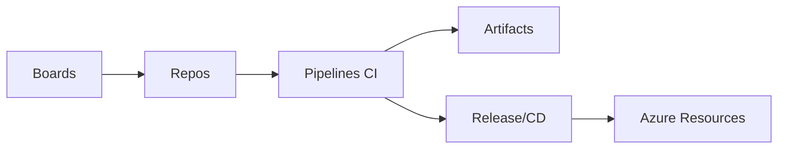

# Azure DevOps

This folder contains **core concepts, commands, diagrams, and practical labs** for Azure DevOps.
Students should place their hands-on outputs in child folders under `AzureDevOps/`.

---

## 1) Important Terms (Quick Reference)
- **Organization / Project**: Top-level account and project container.
- **Boards**: Work items, Kanban, sprints.
- **Repos**: Git repositories within Azure DevOps.
- **Pipelines**: CI/CD workflows (YAML or Classic).
- **Artifacts**: Package feeds (NuGet, npm, Maven, PyPI).
- **Service Connection**: Credential link to Azure or other services.
- **Agent**: Build runner (Microsoft-hosted or self-hosted).

---

## 2) Common Use Cases
- Track work with **Boards**.
- Host source in **Repos** with branch policies.
- Build and test using **Pipelines**.
- Release to environments with approvals.
- Publish and consume packages via **Artifacts**.

---

## 3) Diagram (Mermaid)


---

## 4) Essential Commands
> These are mostly CLI commands for Azure DevOps and Git.

### Azure DevOps CLI
```bash
az extension add --name azure-devops
az devops configure --defaults organization=https://dev.azure.com/<org> project=<project>
az devops project list
az repos list
az pipelines list
```

### Git (in Azure DevOps Repos)
```bash
git clone https://dev.azure.com/<org>/<project>/_git/<repo>
git checkout -b feature/my-change
git push -u origin feature/my-change
```

---

## 5) Practical Tasks (Hands-on)
> Create a child folder like `AzureDevOps/StudentWork/<your-name>/` and save screenshots, notes, or files.

### Task 1 — Project Setup
1. Create an Azure DevOps organization and a project named `DevOps-Training`.
2. Add a README in the project wiki or repo.
3. Save project settings screenshot.

### Task 2 — Boards
1. Create an Epic, Feature, User Story, and Task.
2. Add acceptance criteria to the User Story.
3. Move items across the Kanban board.

### Task 3 — Repos + Branch Policies
1. Create a repo named `training-app`.
2. Push initial commit.
3. Require PR approval and build validation.

### Task 4 — Pipeline (YAML)
1. Create `azure-pipelines.yml` to run `echo "Hello Pipeline"`.
2. Enable pipeline and run it.
3. Save the run log output.

### Task 5 — Service Connection + Deploy
1. Create a Service Connection to Azure.
2. Add a stage that uses `AzureCLI@2` to list resource groups.
3. Save pipeline logs as evidence.

### Task 6 — Artifacts
1. Create a feed.
2. Publish a sample package (npm/NuGet).
3. Consume it in a pipeline.

---

## 6) Advanced Practice Ideas
- Set up **multi-stage YAML** with approvals.
- Add **environment checks** (branch, tags).
- Configure **self-hosted agents**.
