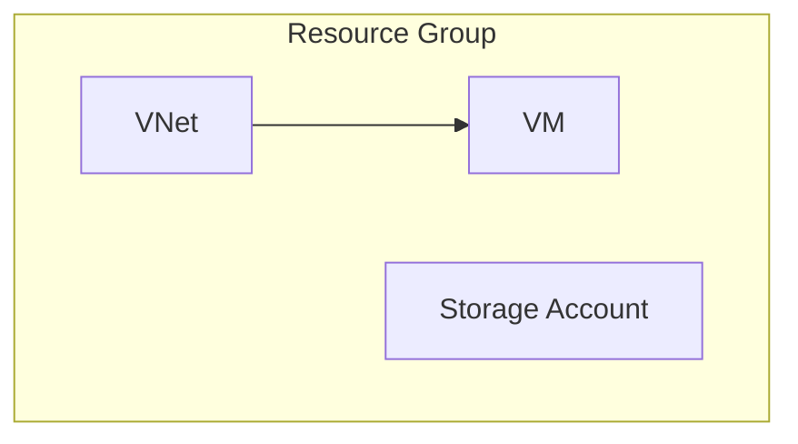

# Azure Infrastructure

This folder includes **Azure infra basics, terms, commands, and hands-on labs**.
Students should save their practice in child folders under `AzureInfra/`.

---

## 1) Important Terms
- **Subscription**: Billing container.
- **Resource Group (RG)**: Logical container.
- **VNet/Subnet**: Azure virtual network.
- **VM**: Virtual machine.
- **NSG**: Network security group.
- **Storage Account**: Storage container for blobs/files.
- **Azure CLI**: Command-line management.

---

## 2) Diagram (Mermaid)


---

## 3) Essential Commands (Azure CLI)
```bash
az login
az account list --output table
az group create --name rg-devops --location eastus

# Networking
az network vnet create --resource-group rg-devops --name vnet-devops --address-prefix 10.0.0.0/16 --subnet-name subnet-devops --subnet-prefix 10.0.1.0/24

# VM
az vm create --resource-group rg-devops --name vm-devops --image UbuntuLTS --admin-username azureuser --generate-ssh-keys

# Storage
az storage account create --name stdevopstraining<unique> --resource-group rg-devops --location eastus --sku Standard_LRS
```

---

## 4) Practical Tasks
### Task 1 — Resource Groups
1. Create `rg-devops-training`.
2. Tag it with `env=training`.

### Task 2 — Networking
1. Create VNet + subnet.
2. Create NSG rules for SSH.

### Task 3 — Compute
1. Create a Linux VM.
2. SSH and update packages.

### Task 4 — Storage
1. Create storage account.
2. Upload a file to a blob container.

### Task 5 — Cost Management
1. Create a budget alert.

---

## 5) Advanced Practice
- Deploy a VM using Bicep/Terraform.
- Enable diagnostics and logs.
- Configure backup.
