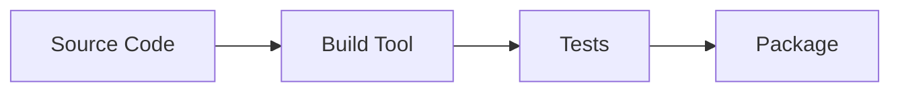

# Development Tools

This folder covers **essential developer tools, commands, and labs**.
Students should save practice work under `DevTools/`.

---

## 1) Important Terms
- **IDE/Editor**: VS Code, IntelliJ, Vim.
- **CLI**: Command-line interface tools.
- **Package Manager**: npm, pip, Maven, NuGet.
- **Build Tool**: Maven, Gradle, npm scripts.

---

## 2) Diagram (Mermaid)


---

## 3) Essential Tools & Commands
```bash
# VS Code (install locally)
# Extensions: GitLens, Azure Repos, YAML

# Azure CLI
az --version

# Git
 git --version

# Docker
 docker --version

# Kubernetes CLI
 kubectl version --client
```

---

## 4) Practical Tasks
### Task 1 — VS Code Setup
1. Install VS Code.
2. Add GitLens and Azure extensions.

### Task 2 — CLI Setup
1. Install Azure CLI.
2. Run `az login`.

### Task 3 — Build Tool
1. Create a sample project (Node/Java/Python).
2. Run a build or package command.

---

## 5) Advanced Practice
- Configure editor settings for linting.
- Add tasks.json for build/test in VS Code.
