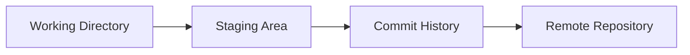

# Git

This folder provides **Git fundamentals**, commands, diagrams, and hands-on tasks.
Students should save practice work in child folders under `Git/`.

---

## 1) Important Terms
- **Repository**: Project history and files tracked by Git.
- **Commit**: Snapshot of changes.
- **Branch**: Parallel line of development.
- **Merge**: Combine branches.
- **Rebase**: Replay commits on a new base.
- **Remote**: Remote copy of a repository.
- **Stash**: Temporary save of uncommitted changes.

---

## 2) Diagram (Mermaid)


---

## 3) Essential Commands
```bash
# Start a repo
mkdir my-repo && cd my-repo
git init

# Track files
echo "Hello" > hello.txt
git status
git add hello.txt
git commit -m "Initial commit"

# Branching
 git checkout -b feature/one
 git checkout main
 git merge feature/one

# Logs and history
 git log --oneline --graph --decorate

# Remote
 git remote add origin <url>
 git push -u origin main

# Stash & Rebase
 git stash
 git stash pop
 git rebase main
```

---

## 4) Practical Tasks
### Task 1 — Commit Practice
1. Create 3 files and commit each with a clear message.
2. Use `git log --oneline` to verify.

### Task 2 — Branch & Merge
1. Create a branch `feature/task2`.
2. Edit a file in the branch, commit.
3. Merge into main.

### Task 3 — Conflict Resolution
1. Edit the same line in `main` and `feature/task2`.
2. Merge and resolve conflict.

### Task 4 — Stash
1. Make uncommitted changes.
2. `git stash` then `git stash pop`.

### Task 5 — Rebase
1. Create a branch and two commits.
2. Rebase onto main.
3. Fix any conflicts.

---

## 5) Advanced Practice
- Create annotated tags.
- Use interactive rebase to squash commits.
- Revert a commit and compare with reset.
