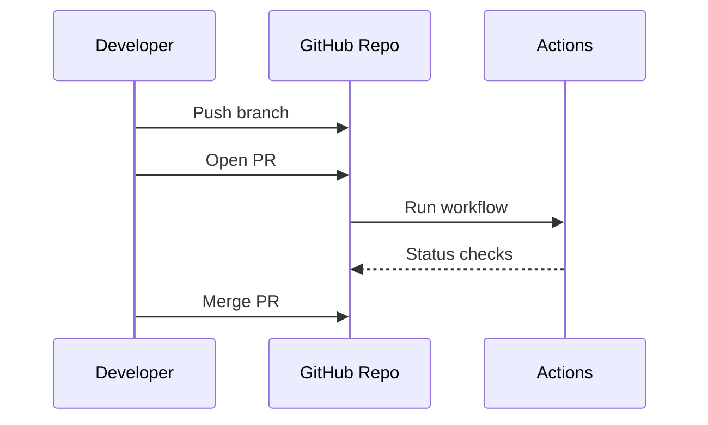

# GitHub

This folder contains **GitHub basics, terms, workflows, and labs**.
Students should save practice work under `GitHub/`.

---

## 1) Important Terms
- **Fork**: Personal copy of a repo.
- **Pull Request (PR)**: Request to merge changes.
- **Issues**: Track tasks/bugs.
- **Actions**: CI/CD workflows.
- **Protected Branch**: Rules for merging.

---

## 2) Diagram (Mermaid)


---

## 3) Essential Commands
```bash
# Link local repo to GitHub
 git remote add origin <url>
 git push -u origin main

# Create branch and push
 git checkout -b feature/github
 git push -u origin feature/github
```

---

## 4) Practical Tasks
### Task 1 — Create Repo
1. Create a GitHub repo.
2. Add README and license.
3. Clone locally.

### Task 2 — Pull Request
1. Create a new branch.
2. Make a change and push.
3. Open a PR and request review.

### Task 3 — GitHub Actions
1. Add `.github/workflows/ci.yml`.
2. Use `echo "Hello Actions"`.
3. Verify workflow runs.

### Task 4 — Branch Protection
1. Enable branch protection on main.
2. Require PR and status checks.

---

## 5) Advanced Practice
- Use CODEOWNERS file.
- Configure auto-merge.
- Create issue templates.
