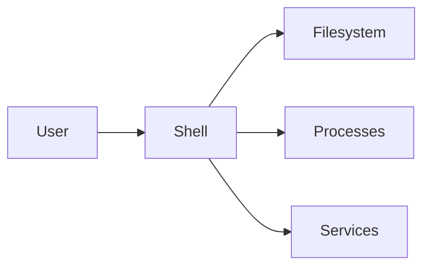

# Linux Administration

This folder provides **Linux fundamentals, commands, and labs**.
Students should save practice work in child folders under `LinuxAdmin/`.

---

## 1) Important Terms
- **Filesystem**: Directory hierarchy starting from `/`.
- **Permissions**: Read/Write/Execute for user/group/others.
- **Process**: Running program.
- **Service**: Background daemon (systemd).
- **Package Manager**: apt/yum/dnf.

---

## 2) Diagram (Mermaid)


---

## 3) Essential Commands
```bash
# Navigation
pwd
ls -la
cd /etc

# Files
mkdir demo
cd demo
echo "test" > file.txt
cat file.txt

# Permissions
chmod 644 file.txt
chown $USER:$USER file.txt

# Processes
ps aux | head -n 5
kill -9 <pid>

# Services
systemctl status ssh
sudo systemctl restart ssh

# Networking
ip a
ss -tuln
curl -I https://example.com
```

---

## 4) Practical Tasks
### Task 1 — Filesystem
1. Create `/tmp/training` and 5 files.
2. Use `find` to list them.

### Task 2 — Permissions
1. Create a file and set permissions to 600.
2. Verify with `ls -l`.

### Task 3 — Processes
1. Start a background process (`sleep 300 &`).
2. Find PID and kill it.

### Task 4 — Services
1. Check status of SSH service.
2. Restart service safely.

### Task 5 — Logs
1. Use `journalctl -u ssh -n 20`.
2. Save logs to a file.

---

## 5) Advanced Practice
- Write a simple bash script and schedule with cron.
- Configure users and groups.
- Monitor disk usage with `df -h`, `du -sh`.
